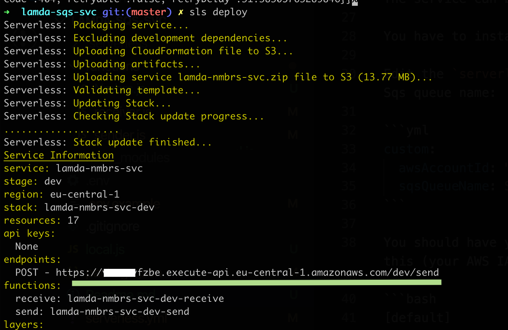

# Nmbrs service

## Description

This service collects absence times from the [Nmbrs](https://nmbrs.nl/) software.
Provided a valid Authorization, it queries all companies, the companies employees and their respective absence days from the [Nmbrs API](https://api.nmbrs.nl/).

## Running the service

The service can be run locally or [AWS Lambda](https://aws.amazon.com/lambda/), where it gets triggered from [AWS SQS](https://aws.amazon.com/sqs/).

### Run service locally

First, `npm install` the dependencies.
Then, copy the `.env.example` file and add your credentials:

```
NMBRS_USERNAME=<your username / email>
NMBRS_TOKEN=<your token>
```

To start the service, run `node local.js`

### Running service on AWS

The service can be deployed to AWS using the [serverless framework](https://serverless.com/).

You have to install `serverless` globally by running `npm i -g serverless`.

Edit the `serverless.yml` file in the project root to add your AWS Account ID and (optionally) change the Sqs queue name:

```yml
custom:
  awsAccountId: "123456789"
  sqsQueueName: SnsNmbrsQueue
  s3BucketName: nmbrs-users-absence
```

You should have your AWS CLI setup or at least have a valid `~/.aws/credentials` file with something like this (your AWS IAM User credentials for the account you want to deploy to):

```bash
[default]
aws_access_key_id = <your access key>
aws_secret_access_key = <your secret>
```

Then you can run `serverless deploy` and the service should be deployed.
The output should reveal a `/dev/send` endpoint and look something like this:



This is the endpoint we can use to add messages to our SQS queue.

For example, using `curl` or something like [Postwoman](https://postwoman.io/):

```bash
curl -H "Content-Type: application/json" -X POST -d "{\"username\": \"<your email>\", \"token\": \"<your api token>\"}" <your endpoint>
```
